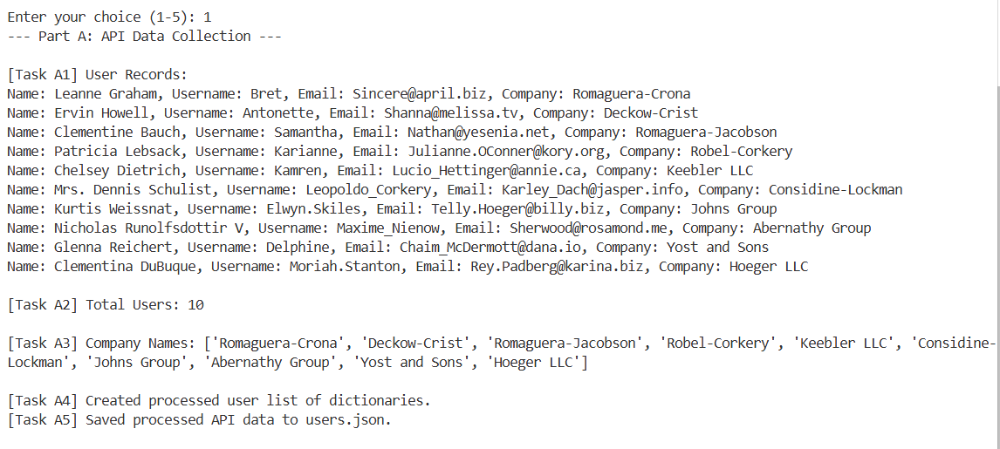
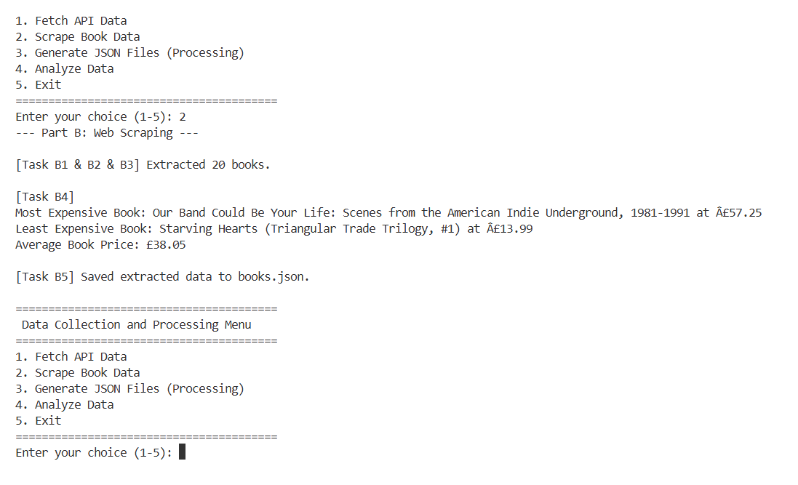
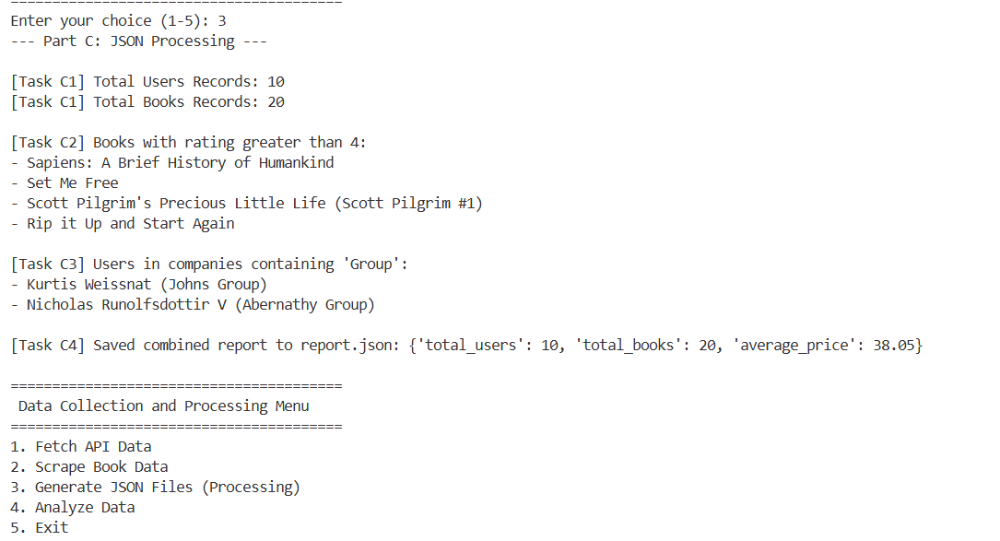
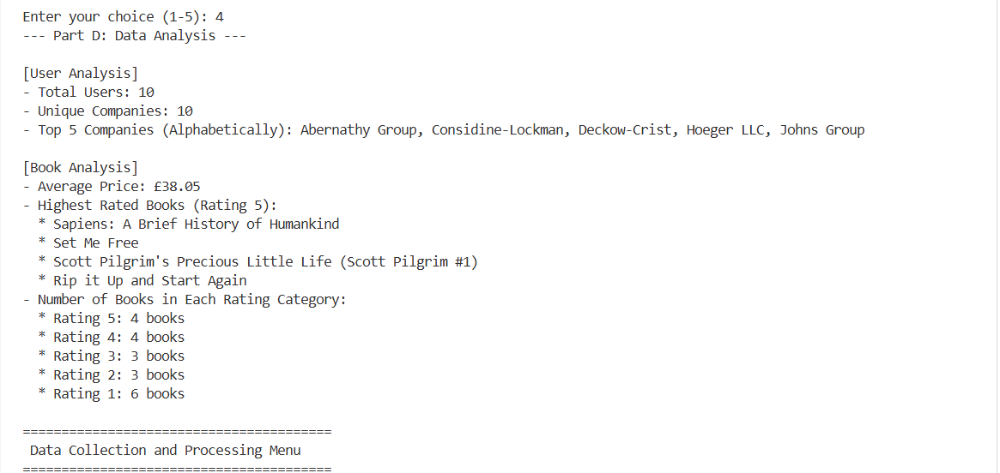
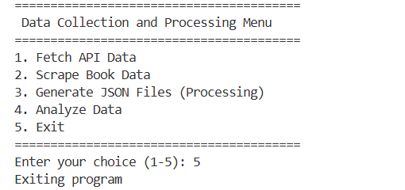

# Data Collection and Processing Assignment

This project is part of the Python for Data Engineering course assignment. It involves collecting data from APIs and web scraping, processing it into JSON format, and performing data analysis.

## Project Structure
```text
Assignment/
│
├── api_data.py         # Script to fetch and process user data from JSONPlaceholder API
├── web_scraping.py     # Script to scrape book information from books.toscrape.com
├── json_processing.py  # Script to read, filter and summarize the collected JSON data
├── analysis.py         # Script to perform basic analysis on the user and book data
├── main.py             # Menu-driven program to run all tasks (Bonus Challenge)
│
├── users.json          # Generated by api_data.py
├── books.json          # Generated by web_scraping.py
├── report.json         # Generated by json_processing.py
│
└── README.md           # Project documentation
```

## Setup Instructions

1. Ensure you have Python 3.x installed.
2. Install the required external libraries:
   ```bash
   pip install requests beautifulsoup4
   ```

## How to Run

You can run the entire workflow interactively using the menu-driven script:

```bash
python main.py
```

From the menu, select options 1 through 4 sequentially to fetch data, scrape the website, generate reports, and analyze the results.

Alternatively, you can run each script individually:

```bash
python api_data.py
python web_scraping.py
python json_processing.py
python analysis.py
```

## Features
- **API Integration**: Connects to a REST API, parses JSON responses, and stores selected fields.
- **Web Scraping**: Uses `requests` and `BeautifulSoup` to extract book titles, prices, and ratings from a fictional bookstore.
- **JSON Processing**: Reads multiple JSON files, performs filtering, and aggregates data into a final report.
- **Data Analysis**: Computes summary statistics like total counts, unique values, averages, and categorical groupings.

## Screenshots

### 1. Fetch API Data


### 2. Scrape Book Data


### 3. Generate JSON Files


### 4. Analyze Data


### 5. Exit Program

